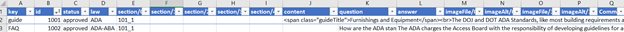

# KMS
OTIS Knowledge Management System

## How to convert KMS from Excel to JSON/JavaScript

1. Data should be entered into Excel file.

2. Format data is a table with headings using the following structure:

* Additional "/#" columns can be added in the future if needed.
* Data in column "key" should be: FAQ, guide, clarification, (FRM)
  - the names of these items are very important, do not change
* sections should be added in the same format with "_" instead of periods
* HTML can be added into contents, question, and answer boxes
  - be sure your HTML is perfect, a missing ">" could result in appearance error
* images should be stored in the folder \built environment KMS\images \KMS\ADA
  - image file names need to have the file extension ie .jpg or .png

3. filter data to the specific law/KMS you are going to update
  - for example the ADA KMS should be filtered to only have data from ADA, ADA-ABA

4. Select all and Copy Excel data.

5. Go to: <https://www.convertcsv.com/csv-to-json.htm>

6. Paste data here:

7. Expand "step 3: choose output options", and check the box "Do Not output field/value pair if value is empty"

a. some files like the scoping and mapping links may also require you to select "force wrap number values in double quotes"

8. Go to step 5, and choose "CSV to keyed JSON"

Output data should look something like this:

{

   "FAQ": [

      {

         "id": "30001",

         "law": "ADA-ABA",

         "section": [

            "302_1"

         ],

         "question": "Must accessible surfaces be paved?",

         "answer": "Concrete, asphalt, and other paved surfaces....  "

      },

      {

         "id": "40006",

         "law": "ADA-ABA",

         "section": [

            "305_1",

            "404_1"

         ],

         "question": "Can doors swing into required clear floor or ground space?",

         "answer": "Doors cannot swing into required clear floor in these specific instances:  <ul><li>clear floor space at controls for automatic and power assisted doors and gates (404.3.5)</li></ul>..."

      },

      {

         "id": "30009",

         "law": "ADA-ABA",

         "section": [

            "304_1",

            "305_1",

            "404_2_4"

         ],

        "question": "Is there a minimum distance between changes in level?",

         "answer": "The standards do not require a minimum ... between changes in level of a ½\" or less.     

       }

   ],

   "guide": [

      {

         "id": "30012",

         "law": "ADA-ABA",

         "section": [

            "304_1"

         ],

         "content": "text"

      },

      {

         "id": "Sid0013",

         "law": "ADA-ABA",

         "section": [

            "309_1"

         ],

         "content": "text"

      }

   ]

}

1. go to KMS folder. Rename the existing kmsADA.js to "kmsADA-old-[date].js"

2.  

3. Paste all content into Notepad or Notepad++

4. Add "var kmsADA = "  before all content.

var kmsADA =

{

   "FAQ": [

      {

         "id": "Sid0001",

         "law": "ADA-ABA",

         "section": [

..........

5. Save file as "kmsADA.js"

6. Paste file into the KMS folder.

7. (Optional) Verify everything is loaded with the browser's inspector.

a. You should see everything is loaded successfully, or get an alert that says there was an error. Go to the troubleshooting guide for more information.

8. If something does not work and cannot be easily fixed through troubleshooting, revert to a previous version by deleting or moving the current file and renaming the old file back to kmsADA.js

9. changes should be made to everyone's computer automatically because their version should be synced. Loading it the first time may take a little longer, after that it should load quickly
